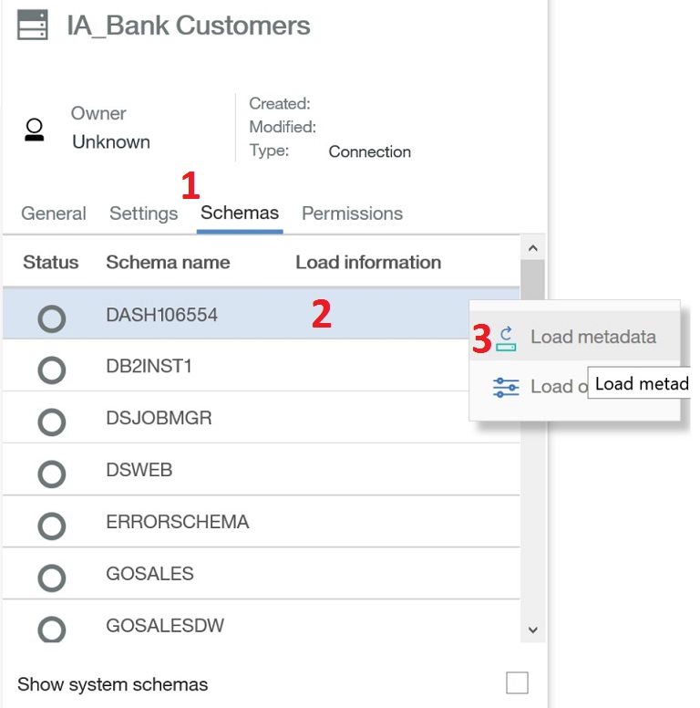
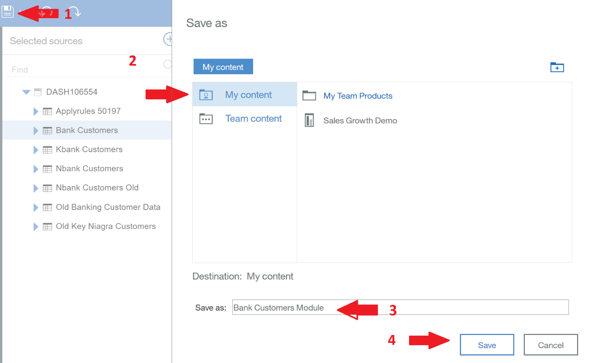
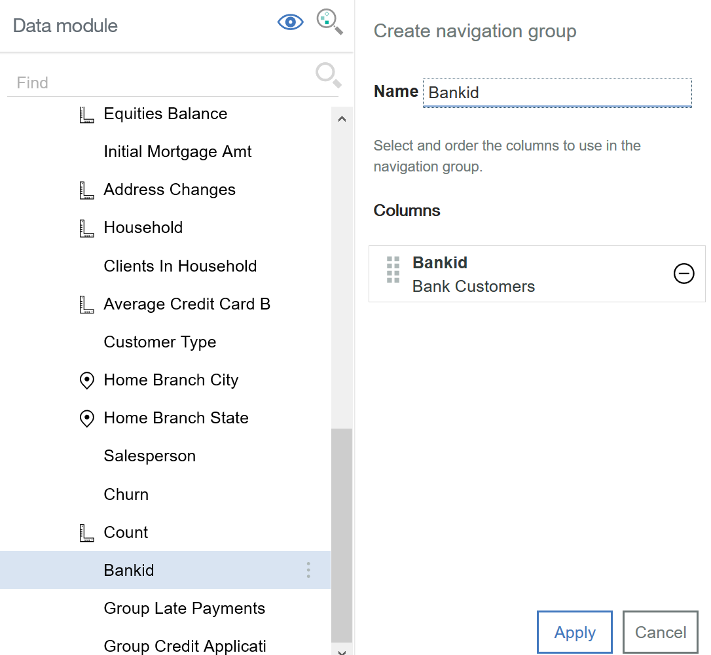
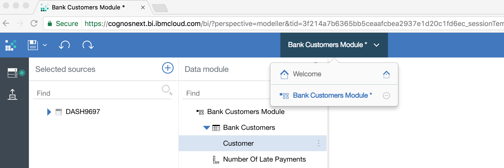
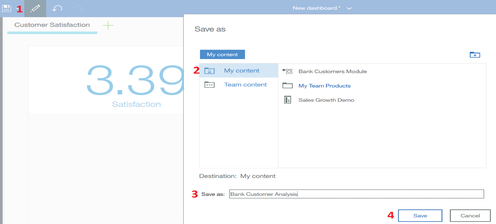
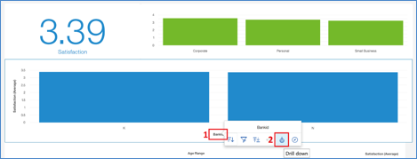
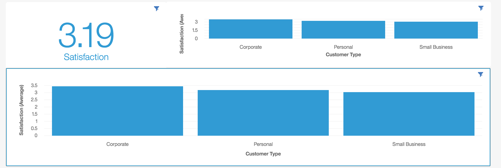
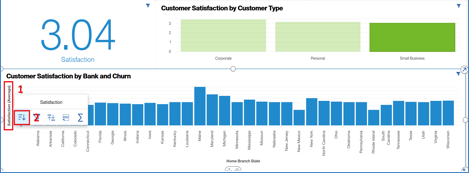
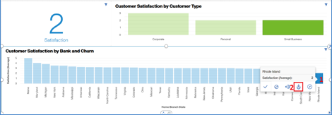

## Step 1: Setup Cognos

[Click Here to Go to Cognos Analytics on Cloud](https://www.ibm.com/analytics/us/en/technology/products/cognos-analytics/)

1. **Select** the **Sign In** button in the top right corner.

2. **Enter** your IBM Account.

> Cognos Analytics on Cloud checks if the IBM account entered is associated with an IBM w3ID. If you are an IBM employee with a w3ID, complete the login process using section [Authenticate uisng your IBM w3ID](#w3). Otherwise, continue with step 3 and 4 below:

3. **Enter** your IBM Account **password**.
4. **Select** the **Log in** button.

You are brought to the Cognos Analytics on Cloud home page.

<a name="w3" />

### Authenticate using your IBM w3ID

1. **Select** the **Continue** button to gain access to IBM Cognos Analytics on Cloud using your IBM w3ID.

2. **Enter** your **w3ID** and **password**
3. **Select** the **Sign In** button.

4. **Check or Uncheck** the checkbox depending your choice of being informed of IBM products....
5. **Select** the **Continue** button.

You are brought to the Cognos Analytics on Cloud home page.

### Create a Data server connection

1. **Select** the **Manage** button on the bottom left side of the home page.
2. **Select** the **Data server connections** menu item to create a new data server connection.

3. **Select** the **+ plus sign** to create a new connection.
4. **Select** a type of **dashDB**.

> 
> **Go Back** to your Bluemix account to your dashDB service credentials section that you created in the PreWork section. You will need the **jdbcurl**, **username** and **password** from the credentials section of the service to complete the creation of your data server connection in the following steps.
> 

5. **Select** the **edit** icon that looks like a pencil next to the "New data server connection" name. **Enter** a new name of **Bank Customers** and **click** outside the edit area to save the name.
6. **Copy and Paste** the **jdbcurl** from your dashDB service credentials section into the data connection JDBC URL text box.

> Your JDBC URL might look something like this (do not paste the quotes):
> **"jdbc:db2://dashdb-entry-yp-dal09-08.services.dal.bluemix.net:50000/BLUDB"**

1. You need to specify the sign in credentials for the dashDB user to use each time you connect to this database. Select the Use the following signon check mark  

1. Select the  ‘+’ icon 

1. Enter the your dashDB User ID

1. Enter your password and confirm your password

1. Click on the Test Button to verify your new connection.  If it tests successfully, then

1. Click Save

If the test fails, check the userID, password, etc. and re-test.

Now we need to select the database schema (table owner) that we will use in this exercise. 

1. Select the Schema tab for the IA_Bank Customers data server connection

1. Select the schema associated to your userid and select

1. Select Load metadata. 

 When the schema is successfully loaded, the status button next to the schema will turn green

### Create a Data Module

With Cognos Analytics, users are not restricted to only using existing enterprise data sources. Users can blend perosnal data or external data with enterprise data to gain deeper insight. Users can connect to enterprise data directly, or they can import other data sets from from files or other data sources into Cognos Analytics. These data sources can be blended, cleansed and joined together to create a reusable **data module** for use in dashboards and reports, and/or shared with other users in the organization. Although this lab has only one data source, we will still create a data module.

To create a new data module, select New from Navigation Bar on the left side of the Cognos Analytics screen and then select Data module

This will take you to the Create data module screen and provide a list of options you can choose from. 

1. Select Data servers (because we are going to connect to the ‘IA_Bank Customers’ data server connection you created earlier.

1. Select IA_Bank Customers from the list. This will display the schema we created earlier. 

1. Select the ‘Schema’ associated with your dashDB instance, ours is **DASH106554** in this instance.

Your schema will now be added to Selected sources list. Again ours is **DASH106554**.

Click on the Start button.

### Data modeling

Once a data source is selected, users can enter their desired search term(s) and click on Go to look for tables with data related to that search term. Cognos Analytics will analyze the data source and present table(s) that have some relation to the term you entered that you can add to your data module. Since we want to look into our Bank customers to analyze satisfaction and churn data,  

1. In the intent panel, type Customers

1. Click on Go

1. While we show multiple tables here, you should only see a single table, named **Bank Customers**.  Select the Bank Customers table

1. Click on Add this proposal

Your data module should look like this

We will save our data module now.

1. Click Save.

1. Select My Content.

1. Type ‘Bank Customers Module’ for the name.

1. Click Save

Expand the Bank Customers table in the Data Module View

You have told us that your Data Scientists have found some interesting correlations between the number of late payments a customer has had in the past and their propensity to churn. Because this has been identified as an interesting factor for further analysis, we will divide the data into groups based on how many late payments they have had. 

Select the Number of Late Payments column and click on more options (the 3 dots, one above the other)

Select Create custom groups

We can see that Cognos Analytics suggests creating an equal distribution of the late payment values into 10 groups distributed evenly.

However, we will create 3 groups based on the findings of your Data Scientists.

1. Change the Group name to Group Late Payments

1. Change How many groups? from 10 to 3

1. Select Custom

1. Change the lowest value to 1

1. Change the middle value to 21

1. Change the highest value to 3000

1. Click on Create

The data scientists have also observed a correlation between the number of credit applications a customer has submitted and their tendency to churn. So we will also create a another Custom group for the number of credit applications. Create a
new custom group based on the Number of Credit Applications.

Again, we will create 3 groups.

Select the Number of Credit Applications column and click on more options

1. Change the Group name to Group Credit Applications (Note, we mis-spelled this, but you can spell it correctly if you wish)

1. Change How many groups? from 10 to 3

1. Select Custom

1. Change the lowest value to 5

1. Change the middle value to 26

1. Change the highest value to 3000

1. Click on Create

**Save the data module**

### Create Navigation Group

Navigation groups allow drill downs that align with how users want or need to analyze their business. In this case the Bankid column identifies whether the data is from "K Bank" or "N Bank". 

Go back to your Data module

- Scroll to the Bankid column in the Bank Customers table and select it

- Select more options for the Bankid column

- Select Create navigation group. 

The default name will be Bankid since that is the name of the column we selected first.

In our Analysis we want to look at information by Originating Bank, churn, customer type, branch location and customer.

1. Rename the Navigation Group to Bank Churn Drill Path

1. Drag the Churn column below Bankid

1. Drag the Customer Type column below Churn

1. Drag the Home Branch State column below Customer Type

1. Drag the Customer column below Home Branch State

1. Click on Apply

There are many more things we could do in this data module, but for now let's **save** the data moduleand start looking for insight.

## Step 2: Getting Insight

Go back to the Welcome Screen

From the main Cognos Analytics screen, click on the + sign on the left hand side and select Dashboard.

The Template window then appears, allowing you to select the type of dashboard and the template style. 

Select the tabbed dashboard style. This will show you multiple options for the look for your dashboard. 

Select the template with the three small rectangles (panels) across the top, and two full width panels below (on the right above). 

Click on OK.

Each panel on the template acts as a placeholder for dashboard objects, known as widgets. Templates are device aware and will auto-size to the screen of the device being used.

As we build the dashboard, we will reference the location placement for widgets we create in the dashboard template using the following panel numbers

Select the data module we just created, and then 

1. Select the '+' to add sources to the Dashboard

1. Select My content

1. Select the Bank Customers Module

1. Click Open

### Designing a Dashboard

Since this is the first dashboard we are creating you can see in the image above that the default name is Tab1. 

- Click on the tab name Tab 1

- Select the Pencil to bring up the toolbar

- Rename the tab to **Customer Satisfaction**

- Click on the triangle beside the Bank Customers table name to expand it and show the columns in the table

- Drag the satisfaction column to panel 1. Remember the panel layout I showed you earlier? If not, go back and look at the field numbers for the areas of this tab's format.

- Here we can see the average satifaction rating for our customers is 3.39 out of 5

> Note - Satisfaction is very easy to locate in this case because it is one of the first few fields in the list. You can also search for columns names using the Find area at the top of the screen.

Next we want to look at satisfaction by customer type, so we need to select the Satisfaction column and then Control-Click (**Command and Click on Mac**) the Customer type column and drag them to Panel 2. 

Cognos Analytics gives a visualization to start based on the data types and number of values of the columns selected, but you can change these visualizations by selecting the Change Visualization icon. 

That will show the visualizations that best suit the data types of the columns inside the visualization. You can always select **More** if you do not see a format you like. You can click anywhere else in the dashboard to close this window.

Now save the dashboard.  

1. Click Save

1. Select My Content

1. Name the Dashboard ‘Bank Customer Analysis

1. Click Save

If the data source panel is not open, from the Navigation panel on the left side of the screen, select sources to open the data source panel and select the **Bank Customers Module** we are working with.

Expand both ‘Navigation paths’ and ‘Bank Customers’ to list the items they contain by clicking on the triangle beside those names.

1. Under Navigation paths, expand the Bank Churn Drill Path and select Bankid

1. Ctrl-Click (Command-Click) Satisfaction under the Bank Customers Module

1. Drag these items to Panel 4

**Notice that there is little difference in the overall satisfaction between the two banks.**

1. Under Bank Customers Select Satisfaction

1. Under Bank Customers Age Range

1. Under Bank Customers Gender

1. Drag these items to Panel 5

Change the visualization in Panel 5 to a Heat Map

Your Dashboard should like this now

**Notice that on average Males are more satisfied than females, and that on the right, our older customers are the least satisfied.**

Save the Dashboard

Now, let's add another Tab to the Dashboard.  

Click on the green + sign

1. For the template we will choose the 2 x 2 Template

1. Select USE

Rename this tab to Churn Analysis

> Note - The four panels are also numbered in this image so we can explain placement later.

As we said earlier, your data scientists have found that churn seems to be related to the number of credit applictions the customer has submitted, and the number of times they have had late payments. Remember we also created groups for late payments and credit applications, now let's create visualizations for these. 

Add a visualization of churn to late payments using the following steps. 

1. Under Bank Customers in the data module on the left select Group Late Payments

1. Under Bank Customers Ctrl-Click (Command-Click) the Count column 

1. Under Bank Customers Ctrl-Click (Command-Click) the Churn column

1. Drag these items to Panel 1

1. Click on a corner or side of the visualization to expand it to use both panel 1 and panel 2

1. Change the Visualization to a Heat map

> Note - 
> Even though we created three groups we see four groups here. What is different?   
>   
> Notice that the group on the far right is (blank). In this case there were some columns that had no value at all for the number of late payments. In this specific case does this mean that customer had no (ZERO) applications, or that someone forgot to fill in this field, or that there is an applicatio problem somewhere? We need to determine the source of the data and whether it is valid or needs to be fixed. We would beed to verify this data with the bank data engineers.

Now add a visualization of churn to credit applications using the following steps. 

1. Under Bank Customers select Group Credit Applications

1. Under Bank Customers Ctrl-Click (Command-Click) the Count column

1. Under Bank Customers Ctrl-Click (Command-Click) the Churn column 

1. Drag these items to Panel 3

1. Click on a corner or side of the visualization to expand it to use both panel 3 and panel 4

1. Change the Visualization to a Heat map

**From these graphics we can see that our most loyal customers are the ones with the least credit applications and late payments.**

> Note - 
> We see the same thing in this graphic with some data being (blank). Again, we could assume that a blank is a zero, but for more accurate analysis we should clean up the data and update the blnk to a 0 (zero).

**The Churn Analysis tab should look like this**

Save the Dashboard
  

Let's go back to the Customer Satisfaction tab, since that was the main reason for the work we have done so far. 

In the middle of the window we two bars, K and N (K Bank and N Bank).

Click the Bankid label under those bars and select drill down

We now see two bars, yes and no (yes means the customer has left the back, no they have not). 

Let’s investigate the customers who have left (yes). 

Wwe can see that the satisfaction scores are lower for the yes bar (the people who have left). Click on the y bar and click on drill down. We notice that all of the visualizations change to be relative to customers who left, and that the satisfaction score changes to a lower number, which makes sense. 

We now see that our Small Business customers have the lowest satisfaction scores (3.04). We can dig deeper into these customers by clicking on the Small Business bar and click Drill down. 

This shows the States of the customers who left the bank. In this case since we are filtered on Small Business, we see the satisfaction level of all Small Business customers who have left, by their state. To find the state with the lowest satisfaction score:

1. Click the Satisfaction (Average) axis title on the left hand side of the chart

1. Select the Sort icon

1. Select Sort desending

We see that Rhode Island has the lowest satisfaction level. We can select the Rhode Island bar and select drill down to find out which customer(s) from Rhode Island closed their accounts. 

We see that we had one customer (UX10401) leave us from Rhode Island, and their satisfaction level was 2.  

Additionally, if we look at the bar below, we can see that this customer was a 70 - 79 year old female.

> Note -
>
>You can click on any part of the dashboard and the rest of the dashboard will filter based on the value you select.

**We would usually title these graphs, set maximums on graphs, specify different colors, etc. to make the Dashboard more appealing before sharing across the enterprise (or at the board meeting). And you can see in the images that we have done that here. But, for the purposes of this demo we will have you do that.**

# Take a screen capture or screen shot of this dashboard tab to show that you have completed the lab. 
