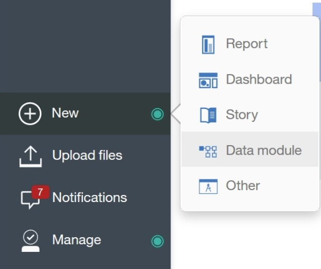
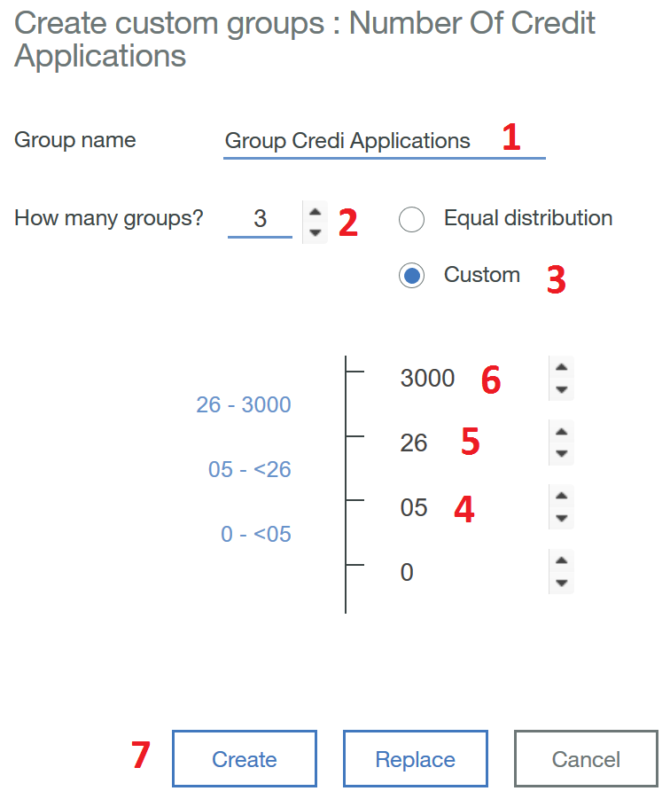
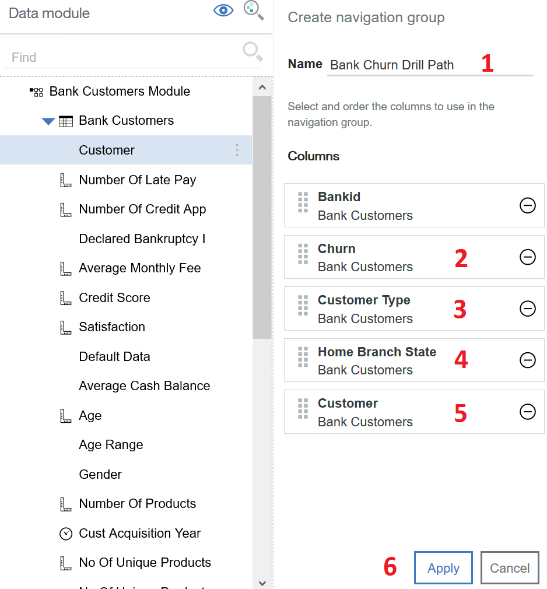
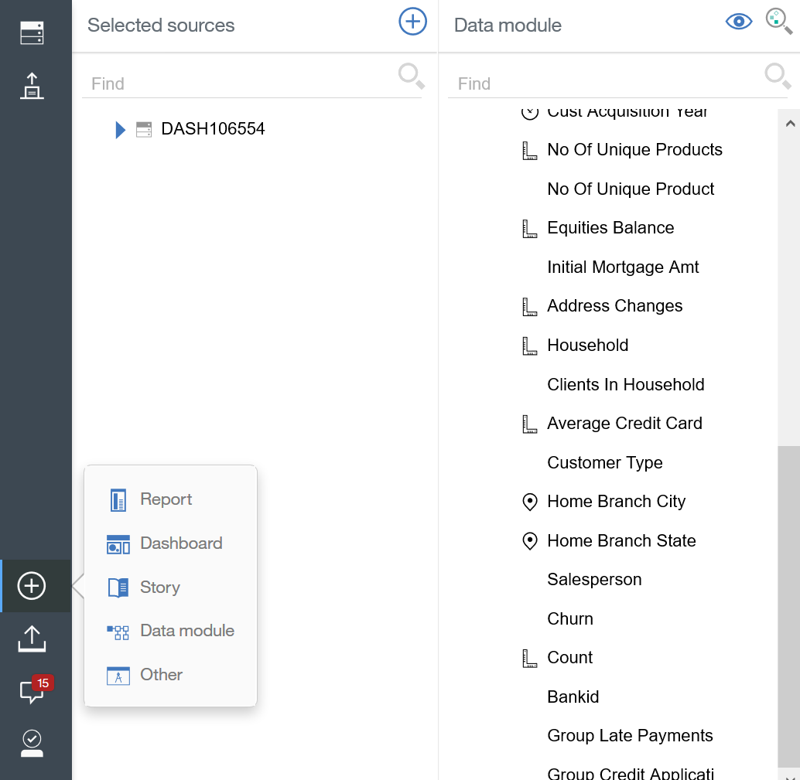
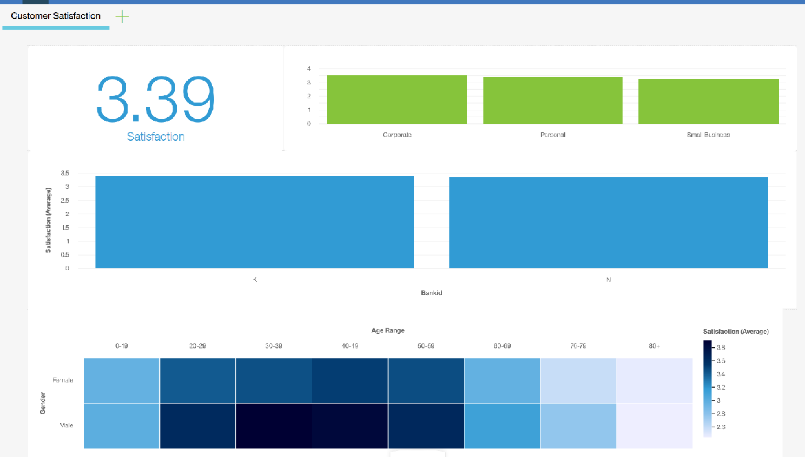
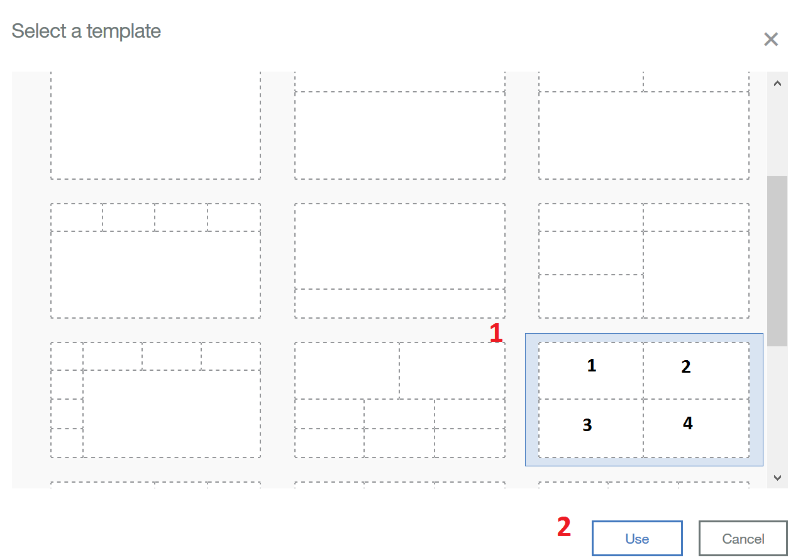
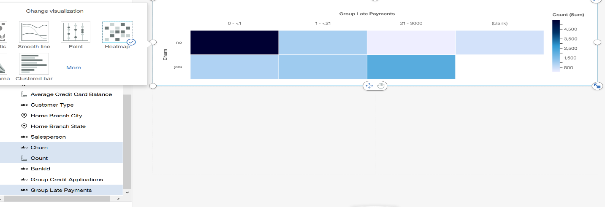

# Moving data and workloads from on-premises to the Cloud for more agile analytics

- **[Introduction](#introduction)**
- **[Narrative](#narrative)**
- **[Solution Overview](#solution-overview)**
- **[Solution Components & Services](#solution-components-and-services)**
- **[Prerequisites](#prerequisites)**

**The main part of the lab starts here**

- **[Move the Data to the Cloud](#move-the-data-to-the-cloud)**
    - [Step 1: Create the Cloud Data Analytics lab services](#step-1-create-the-cloud-data-analytics-lab-services)
    - [Step 2: Create the dashDB Credentials](#step-2-create-the-dashdb-credentials)
    - [Step 3: Work with the VM](#step-3-work-with-the-vm)
    - [Step 4: Update the Lift Properties](#step-4-update-the-lift-properties)
    - [Step 5: Update the Secure Gateway ID](#step-5-update-the-secure-gateway-id)
    - [Step 6: Move Data to the Cloud using Data Connect](#step-5-move-data-to-the-cloud-using-data-connect)

- **[Analyze the Data](#analyze-the-data)**
    - [Step 1: Setup Cognos](#step-1-setup-cognos) 
    - [Step 2: Getting Insight](#step-2-getting-insight) 

# Introduction

This project provides a reference implementation for moving data from on-premises relational database(s) into a Cloud Managed Database Service (dashDB) so that the data can be analyzed quickly, easily, and without the need to setup any new hardware or request resources from the IT department. In this example, the on premises databases are in two different RDBMS'es to emulate two different organizations. However, you could use a similar pattern and set of step to copy from a single database into the cloud as well. 

In this case, one organization is using IBM's PureData System for Analytics (Netezza) and the other DB2 on Linux for their data warehouses. The data from these systems will be pushed into dashDB in the cloud so that it can be combined and analyzed as a single entity.  

**We will provide two mechanisms for moving the data from on-premises to the cloud, Bluemix Data Connect and Lift CLI, so that you can choose the method based on who you demoing to.** Data Connect is a cleaner, easier solution for one time moves, and best used when demoing to Business Users (LOB managers and executives). Lift CLI is how we would productionalize the initial and delta data load process, and best used when demoing to IT.

### Loading data using IBM Data Connect

### Loading data using IBM Bluemix Lift CLI

# Narrative 

Consider the following scenario: You are talking to the Chief Marketing Officer (CMO) at "K Bank". 

Hi Ms. Smith, I know that "K Bank" just bought "N Bank", and I just came from a meeting on how you plan to integrate the two companies’ systems, and it is going to take quite a while. I would think that many people, and you in particular, can’t wait for a year or more for the integrated data to start reaching out to your customers.

I know that "K Bank" has been doing churn analytics for some time, but the team at "N Bank" has not. "K Bank" has found that customer loss (churn) is directly related to the customer's satisfaction level. This is kind of obvious, so it would be interesting to see how these churn prediction models could be used to looks at "N Bank" customers and identify who might be at risk of leaving. Since "K Bank" just spent a lot of money to acquire "N Bank", you do not want to lose any customers if you can help it.  

IBM can help you combine the data from both banks now, so that you can get access to this combined data within days, without putting any load on your IT staff who is already overloaded with the consolidation.  We can use IBM's fully managed cloud services to copy data from your current on-premises systems in each bank into a cloud data warehouse and give you a single view of your customers across both banks.
 
Once you have that data at your fingertips, you can explore the data and discover how satisfied your customers are, within each Bank and across both Banks. You can also identify which customers are leaving the bank and which ones you should strive to retain.

We can quickly show you how to create a dashboard to showcase your findings, use it to tell a story of what you discovered and the actions you might want to take base on this analysis.

# Solution Overview

The solution is a set of Business Inteligence (BI) tools that allow Business Users to get quick but important insights from the data. In order to gain this insight the data from both bank systems need to be moved from their data centers into a common repository. Because IT cannot support creating and managing a new system and moving the data, the new, common repository needs to be hosted as a managed cloud service. The BI tools will then be connected to this new repository and the existing analytical reports will be run. 

# Solution Components and Services

There are a few components of this solution. We used a VM to emulate the on premises systems, PureData System for Analytics (Netezza) and DB2. Both of these systems are commonly used by financial firms due to the performance and security they provide - not only for data at rest, but also data as it is being queried.   

We chose dashDB for Analytics (to be renamed **Db2 Warehouse on Cloud** as of ~July 18th) as the combined repository since it is a fully namaged service in the cloud that can be expanded easily, needs no administration, and has built in encryption and security. ** Note -** dashDB is ISO 27001, SOC 2, SOC 3 and HIPAA certified.

Data Connect uses the Secure Gateway to encrypt the data on the wire and Lift uses Aspera to transfer the data using very high levels of compression as well as automatic encryption.   

Cognos Analytics is modern, self-service Business Intelligence Platform that provides a sleek and intuitive user experience. Cognos Analytics provides the ability to empower everyone in the organization to find insight from their data to positively impact their decision making.

# Prerequisites

You will need the following:

 - VMware
      - VMware Player or VMware Workstation for Windows
      - VMware Fusion (Full or 30 day trial) for OSX
 - The Virtual Machine (VM) for the lab
      - Download the [VMware Image](https://ibm.box.com/s/50uj4kfg87qe3rd3icjfvlx94xaygdmr) 
        > **Note** - The image download is 11 GB -- make sure you have a reliable high speed network to download this file! When unzipped the VMware image will consume 20GB of local disk (and up to 20GB temp space), and 3GB RAM. Users with limited RAM (8GB) will want to shut down as many applications as possible prior to launching VMware.
 - A Bluemix account
 - A provisioned Data Connect Starter service in Bluemix
 - A provisioned dashDB for Analytics (**Db2 Warehouse on Cloud** *as of ~July 18*) Entry service in Bluemix
 - dashDB access credentials
 - A Cognos Anlaytics Trial

> **Note**  
If you need help with any of the pre-requisites, go to the [Prerequisite Step by Step Directions](https://github.com/ibm-cloud-architecture/refarch-cloud-data-analytics/blob/master/PreWork.md) page

# Move the Data to the Cloud

## Step 1: Create the Cloud Data Analytics Lab Services

1. **Select** the "Catalog" menu at the top of the Bluemix home page.

2. **Enter** "data connect" (without quotes) in the catalog search area.  

3. **Click on** the “Data Connect” service.  

4. **Enter** "CDA Data Connect” (without quotes) for the Service name.  (Use CDA as the acronym for Cloud-Data-Analytics).

5. **Enter** “CDA Data Connect” (without quotes) for the Credential name.  

6. **Select** the the "Create" button. The service will be created and the launch page is displayed.

7. **Select** the **Manage** menu of the CDA Data Connect service on the left.

8. **Select** the **LAUNCH** button to launch the Data Connect service.

9. **Select** the **X** in the top right corner of the Welcome dialog to close it.

10. **Select** the **Secure Gateway** menu from the Data Connect main menu on the left hand side.

11. **Select** the **Add Gateway** button next to the moving arrow to add a gateway.

12. **Enter** a gateway name of **Cloud-Data-Analytics**.

13. **Uncheck** the "Require security token to connect clients" check box.

14. **Uncheck** the "Token Expiration" check box.

15. **Select** the **Add Gateway** button.

16. **Select** the **Settings** buton at the top of the page to view the Gateway settings.

17. **Select** the **Copy** button next to the Gateway ID to copy the Gateway ID to the clipboard. **Note -** this is a **very important** step because you are going to need this Gateway ID further on in the Prework to supply to the Secure Gateway client configuration file thta is installed on the VM image. Remember this ID or save it off so you can easily get back to it when its needed.

18. **Select** the **X** in the top right corner of the settings dialog to close the dialog.

19. **Close** down the Data Connect service by selecting the **X** on the browser tab.

**Go Back** to your Bluemix Account for the next steps. 

1. **Select** the "Catalog" menu at the top of the Bluemix home page. 

2. **Enter** "dashdb" (without quotes) in the catalog search area.  

3. **Click on** the “dashDB for Analytics” service.  

4. **Enter** "CDA dashDB” (without quotes) for the Service name.   

5. **Select** the the "Create" button. The service will be created and the launch page is displayed.

6. **Click On** the "CDA dashDB" service you just created from the list of services.

## Step 2: Create the dashDB Credentials

7. **Select** the "Service credentials” section of the "CDA dashDB" service launch page.   

8. **Select** the the "New credential +" button.

9. **Enter** "CDA dashDB” (without quotes) for the credential name.   

10. **Select** the the "Add" button. The service credential will be created.

11. **Select** the "View credentials v" down arrow to view the newly created credentials.

> **Note** - These are the "CDA dashDB" service credentials you will need to access the dashDB service in the Data Engineering and Data Science labs. Remember how to get back to this area of the service to access the credentials. I have redacted my password, to protect my identity, yours will be visible.

1. **Select** the **Manage** menu of the CDA dashDB service on the left.

2. **Select** the **OPEN** button to open the dashDB console.

3. **Select** the **Run SQL** menu from the left hand side of the console.

4. **Select** all the sample SQL in the SQL scratch pad area and delete it.

5. **Copy and Pate** the dashDB target table DDL from the [Bank Customers DDL File](https://github.com/ibm-cloud-architecture/refarch-cloud-data-analytics/blob/master/bank_customers.ddl).

6. **Select** the Run All button on the toolbar.

7. **Review** the results. It should complete successfully.

8. **Select** the **Tables** menu from the left hand side of the console.

9. **Select** the **BANK_CUSTOMERS** table from the tables drop down list box.

You will see the schema for the new table. The table is empty. You will be moving data from on-premies to this table in the move data to cloud excercies later on in this lab using Data Connect and optionally the Bluxemix Lift CLI.

# Work on the "On Premises" systems
< NOTE - 
< We use a VM with a running DB2 and PureData System for Analytics (Netezza) solution in it.  In reality these would likely be 2 separate systems, in different data centers, but this still represents that environment in a realistic manner.
<  

## Step 3: Work with the VM

## Steps
1. [Unzip the VM Image](#unzip)
1. [Power On the Virtual Machine](#power)
1. [Login to the Vritual Machine](#login)
1. [Update the Lift Properties File](#liftpf)
1. [Update the Secure Gateway ID](#secgwid)

<a name="unzip" />

## Unzip the VM Image

### On Windows

**Locate** the **Cloud Data Analytics.zip** VMWare Image zip file that you downloaded to your system in the Prework section.

**Unzip** the **Cloud Data Analytucs,zip** file using your favorite program of choice; 7 Zip,  WinZip etc.  It will create a **Cloud Data Analytics** folder into the location you choose to put it.

### On Mac OSX

**Locate** the **Cloud Data Analytics.zip** VMWare Image zip file that you downloaded to your system in the Prework section.

**Unzip** the **Cloud Data Analytucs,zip** file by simply **Double Click** the file or by selecting it, right mouse clicking and choosing to open it or open it using the Archive Utility. It will create a **Cloud Data Analytics** folder in the same location where the zip file resides and extract all the files into the folder.

<a name="power" />

## Power on the Virtual Machine

### On Windows

**VMWare Workstation**

**Open** the VMWare Workstation or VMWare Player application (you can use either or to open the VM).

1. **Select** the **File** menu from the toolbar.
2. **Select** the **Open** menu item.

3. **Go to** the location on your file system where you unzipped the VM Image.
4. **Select** the **NetezzaSoftwareEmulator.vmx** file.
5. **Select** the **Open** button.

6. **Select** the "Power on this virtual machine" button to Power on the Virtual Machine.

**VMWare Player**

1. **Select** the **Player** menu on the toolbar.
2. **Select** the **File** menu item.
3. **Select** the **Open** menu item.

4. **Go to** the location on your file system where you unzipped the VM Image.
5. **Select** the **NetezzaSoftwareEmulator.vmx** file.
6. **Select** the **Open** button.

7. **Select** the **Take Ownership** button when prompted.

8. **Select** the "Play Virtual Machine" button to Power on the virtual machine.

### On Mac OSX

**Open** the VMWare Fusion application (VMWare Player is not available for Mac OSX).

1. **Select** the **File** menu from the toolbar.
2. **Select** the **Open** menu item.

3. **Select** the **NetezzaSoftwareEmulator.vmx** file from within the **Cloud Data Analyitcs** VM Image folder.

4. **Select** the **Play** button to Power on the virtual machine.

<a name="login" />

## Login to the Virtual Machine

The credentials for this Virtual Machine are as follows:

Root = root / netezza
Netezza User = nz / nz – You will use these credentials to log into the VM.
Netezza Admin = admin / password – You will use these credentials for your Lift migration.

1. **Enter** a lowercase login id of **nz** and a password of **nz**. The Virtual Machine’s IP Address is displayed.

<a name="liftpf" />

## Step 4: Update the Lift Properties

1. **Enter** a command of **cd $DATA**.

2. **Enter** a command of **ls -la**.

3. **Enter** a command of **vi lift.pf** to edit the Lift properties file.

**Note -** The content in the **lift.pf** properties file is case sensitive. Make sure that when you change values noted below that you keep the values in lowercase or Uppercase. For instance, the **target-user** is in lowercase but the **target-schema** is in Uppercase. Keep them in the same case when doing changes.

4. **Change** the **target-user**, **target-password** , **target-host** and **target-schema** to your dashDB user, password, host and schema (your schema is the same as your user but in Uppercase...) using the credentials from your dashDB for Analytics service Credentials section you obtained in a previous section.
5.	**When finished**, hold `SHIFT` and type `ZZ` to save and close the file.

<a name="secgwid" />

## Step 5: Update the Secure Gateway ID

1. **Enter** a command of **cd /etc/ibm**.

2. **Enter** a command of **ls**.
3. **Enter** a command of **vi segenvironment.conf**.

**Note -** The GATEWAY_ID you will be changing is case sensitve so make sure you type it in exactly as it appears.

4. **Change** the **GATEWAY_ID**, to **GATEWAY_ID="<your_gateway_id>"**. This is your Data Connect service Secure Gateway ID that you were instructed to copy to the clipboard and save off.
5.	**When finished**, hold `SHIFT` and type `ZZ` to save and close the file.

6. **Enter** the command **reboot** to go recycle the VM image. This will esnure thta the Secure Gateway Client restarts and thta it picks up your Gateway ID to communicate with your Data Connect service.

7. 1. **Enter** a lowercase login id of **nz** and a password of **nz** to log back into the VM image.

8. **Enter** the command **cd $DATA** to position yourself in the Lift CLI data directory.

## Step 5: Move Data to the Cloud using Data Connect

** Insert dataconnect.md stuff here ** 

> ____________________________________________________________________________________ 
>
>
> **Note:**
>    
>  
> If you want to try to move the data again using the Lift CLI, go to [Lift4Move.md](https://github.com/ibm-cloud-architecture/refarch-cloud-data-analytics/blob/master/Lift4Move.md)
>  
>  
> ____________________________________________________________________________________ 

# Analyze the Data

"K Bank" has found that customer loss (churn) is directly related to the customer's satisfaction level. This is kind of obvious, so it would be interesting to see how these churn prediction models could be used to looks at "N Bank" customers and identify who might be at risk of leaving. Since "K Bank" just spent a lot of money to acquire "N Bank", you do not want to lose any customers if you can help it.

Now that we have the data in one place, we can explore the data and discover how satisfied your customers are, within each Bank and across both Banks. You can also identify which customers are leaving the bank and which ones you should work to retain going forward. You can also create a dashboard to showcase your findings and use it to tell a story of what you discovered and any actions you might want to take base on this analysis for use in your next board meeting.

## Step 1: Setup Cognos

Launch [Cognos Free Trial](https://www.ibm.com/analytics/us/en/technology/products/cognos-analytics/)
and SIGN IN to bring up the login page.

The NEW User Experience brings you directly into the completely
redesigned Cognos Analytics User Interface (UI). All Cognos Analytics
Users begin their navigation here.

### Create a Data server connection

1. On the Welcome screen, select Manage on the bottom left side. Select Data server connections to create a new data server.

1. Create a new data server connection by selecting the ‘+’ and Select dashDB as the type

1. Rename the connection name from New data server connection to IA_Bank Customers

1. Enter the your dashDB JDBC URL service credentials you obtained in the [prework exercise](https://github.com/ibm-cloud-architecture/refarch-cloud-data-analytics/blob/master/PreWork.md#step-d-create-the-dashdb-credentials).  Copy the "jdbcurl" (NOT the "ssljdbcurl") and paste into Cognos Analytics.  Your JDBC URL might look something like this (do not paste the quotes):  **"jdbc:db2://dashdb-entry-yp-dal09-08.services.dal.bluemix.net:50000/BLUDB"**

1. You need to specify the sign in credentials for the dashDB user to use each time you connect to this database. Select the Use the following signon check mark  

1. Select the  ‘+’ icon 

1. Enter the your dashDB User ID

1. Enter your password and confirm your password

1. Click on the Test Button to verify your new connection.  If it tests successfully, then

1. Click Save

If the test fails, check the userID, password, etc. and re-test.

Now we need to select the database schema (table owner) that we will use in this exercise. 

1. Select the Schema tab for the IA\_Bank Customers data server connection

1. Select the schema associated to your userid and select

1. Select Load metadata. 

 When the schema is successfully loaded, the status button next to the schema will turn green

### Create a Data Module

With Cognos Analytics, users are not restricted to only using existing enterprise data sources. Users can blend perosnal data or external data with enterprise data to gain deeper insight. Users can connect to enterprise data directly, or they can import other data sets from from files or other data sources into Cognos Analytics. These data sources can be blended, cleansed and joined together to create a reusable **data module** for use in dashboards and reports, and/or shared with other users in the organization. Although this lab has only one data source, we will still create a data module.

To create a new data module, select New from Navigation Bar on the left side of the Cognos Analytics screen and then select Data module

This will take you to the Create data module screen and provide a list of options you can choose from. 

1. Select Data servers (because we are going to connect to the ‘IA_Bank Customers’ data server connection you created earlier.

1. Select IA_Bank Customers from the list. This will display the schema we created earlier. 

1. Select the ‘Schema’ associated with your dashDB instance, ours is **DASH106554** in this instance.

Your schema will now be added to Selected sources list. Again ours is **DASH106554**.

Click on the Start button.

### Data modeling

Once a data source is selected, users can enter their desired search term(s) and click on Go to look for tables with data related to that search term. Cognos Analytics will analyze the data source and present table(s) that have some relation to the term you entered that you can add to your data module. Since we want to look into our Bank customers to analyze satisfaction and churn data,  

1. In the intent panel, type Customers

1. Click on Go

1. You should only see a table named **Bank Customers**.  Select the Bank Customers table

1. Click on Add this proposal

Your data module should look like this

We will save our data module now.

1. Click Save.

1. Select My Content.

1. Type ‘Bank Customers Module’ for the name.

1. Click Save

Expand the Bank Customers table in the Data Module View

You have told us that your Data Scientists have found some interesting correlations between the number of late payments a customer has had in the past and their propensity to churn. Because this has been identified as an interesting factor for further analysis, we will divide the data into groups based on how many late payments they have had. 

Select the Number of Late Payments column and click on more options (the 3 dots, one above the other)

Select Create custom groups

We can see that Cognos Analytics suggests creating an equal distribution of the late payment values into 10 groups distributed evenly.

However, we will create 3 groups based on the findings of your Data Scientists.

1. Change the Group name to Group Late Payments

1. Change How many groups? from 10 to 3

1. Select Custom

1. Change the lowest value to 1

1. Change the middle value to 21

1. Change the highest value to 3000

1. Click on Create

The data scientists have also observed a correlation between the number of credit applications a customer has submitted and their tendency to churn. So we will also create a another Custom group for the number of credit applications. Create a
new custom group based on the Number of Credit Applications.

Again, we will create 3 groups.

Select the Number of Credit Applications column and click on more options

1. Change the Group name to Group Credit Applications (Note, we mis-spelled this, but you can spell it correctly if you wish)

1. Change How many groups? from 10 to 3

1. Select Custom

1. Change the lowest value to 5

1. Change the middle value to 26

1. Change the highest value to 3000

1. Click on Create

**Save the data module**

### Create Navigation Group

Navigation groups allow drill downs that align with how users want or need to analyze their business. In this case the Bankid column identifies whether the data is from "K Bank" or "N Bank". 

In the Data module

- Scroll to the Bankid column and select it

- Select more options for the Bankid column

- Select Create navigation group. 

The default name will be Bankid since that is the name of the column we selected first.

In our Analysis we want to look at information by Originating Bank, churn, customer type, branch location and customer.

1. Rename the Navigation Group to Bank Churn Drill Path

1. Drag the Churn column below Bankid

1. Drag the Customer Type column below Churn

1. Drag the Home Branch State column below Customer Type

1. Drag the Customer column below Home Branch State

1. Click on Apply

There are many more things we could do in this data module, but for now let's save it and start looking for insight.

## Step 2: Getting Insight

From the main Cognos Analytics screen, click on the + sign on the left hand side and select Dashboard.

The Template window then appears, allowing you to select the type of dashboard and the template style. 

Select the tabbed dashboard style. This will allow you to have multiple pages for your dashboards. 

Select the template with the three small rectangles (panels) across the top, and two full width panels below. 

Click on OK.

Each panel on the template acts as a placeholder for dashboard objects, known as widgets. Templates are device aware and will auto-size to the screen of the device being used.

As we build the dashboard, we will reference the location placement for widgets we create in the dashboard template using the following panel numbers

Select the data module we just created, and then 

1. Select the '+' to add sources to the Dashboard

1. Select My content

1. Select the Bank Customers Module

1. Click Open

### Designing a Dashboard

Since this is the first dashboard we are creating you can see in the image above that the default name is Tab1. 

- Click on the tab name Tab 1

- Select the Pencil to bring up the toolbar

- Rename the tab to **Customer Satisfaction**

- Click on the triangle beside the Bank Customers table name to expand it and show the columns in the table

- Drag the satisfaction column to panel 1. Remember the panel layout I showed you earlier? If not, go back and look at the field numbers for the areas of this tab's format.

- Here we can see the average satifaction rating for our customers is 3.39 out of 5

> Note - Satisfaction is very easy to locate in this case because it is one of the first few fields in the list. You can also search for columns names using the Find area at the top of the screen.

Next we want to look at satisfaction by customer type, so we need to select the Satisfaction column and then Control-Click the Customer type column and drag them to Panel 2. 

Cognos Analytics gives a visualization to start based on the data types and number of values of the columns selected, but you can change these visualizations by selecting the Change Visualization icon. 

That will show the visualizations that best suit the data types of the columns inside the visualization. You can always select **More** if you do not see a format you like. You can click anywhere else in the dashboard to close this window.

Now save the dashboard.  

1. Click Save

1. Select My Content

1. Name the Dashboard ‘Bank Customer Analysis

1. Click Save

If the data source panel is not open, from the Navigation panel on the left side of the screen, select sources to open the data source panel and select the **Bank Customers** data source we are working with.

Expand both ‘Navigation paths’ and ‘Bank Customers’ to list the items they contain by clicking on the triangle beside those names.

1. Under Navigation paths, expand the Bank Churn Drill Path and select Bankid

1. Ctrl-Click Satisfaction under Bank Customers

1. Drag these items to Panel 4

**Notice that there is little difference in the overall satisfaction between the two banks.**

1. Under Bank Customers Select Satisfaction

1. Under Bank Customers Age Range

1. Under Bank Customers Gender

1. Drag these items to Panel 5

Change the visualization in Panel 5 to a Heat Map

Your Dashboard should like this now

**Notice that on average Males are more satisfied than females, and that on the right, our older customers are the least satisfied.**

Save the Dashboard

Now, let's add another Tab to the Dashboard.  

Click on the green + sign

1. For the template we will choose the 2 x 2 Template

1. Select USE

Rename this tab to Churn Analysis

> Note - The four panels are also numbered in this image so we can explain placement later.

As we said earlier, your data scientists have found that churn seems to be related to the number of credit applictions the customer has submitted, and the number of times they have had late payments. Remember we also created groups for late payments and credit applications, now let's create visualizations for these. 

Add a visualization of churn to late payments using the following steps. 

1. Under Bank Customers in the data module on the left select Group Late Payments

1. Under Bank Customers Ctrl-Click the Count column 

1. Under Bank Customers Ctrl-Click the Churn column

1. Drag these items to Panel 1

1. Click on a corner or side of the visualization to expand it to use both panel 1 and panel 2

1. Change the Visualization to a Heat map

> Note - 
> Even though we created three groups we see four groups here. What is different?   
>   
> Notice that the group on the far right is (blank). In this case there were some columns that had no value at all for the number of late payments. In this specific case this would normally mean that customer had no (ZERO) applications, so we could go back and fix the data, but we would beed to verify this data with the bank data engineers.

Nowm add a visualization of churn to credit applications using the following steps. 

1. Under Bank Customers select Group Credit Applications

1. Under Bank Customers Ctrl-Click the Count column

1. Under Bank Customers Ctrl-Click the Churn column 

1. Drag these items to Panel 3

1. Click on a corner or side of the visualization to expand it to use both panel 3 and panel 4

1. Change the Visualization to a Heat map

> Note - 
> We see the same thing in this graphic with some data being (blank). Again, we could assume that a blank is a zero, but for more accurate analysis we should clean up the data and update the blnk to a 0 (zero).

**The Churn Analysis tab should look like this**

Save the Dashboard

# Take a screen capture or screen shot of this dashboard tab to show that you have completed the lab.   

