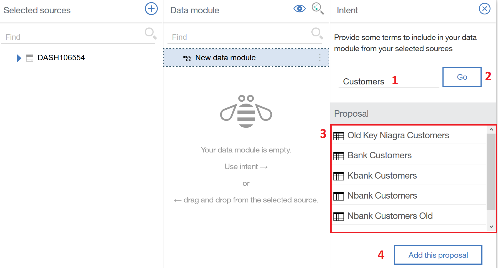
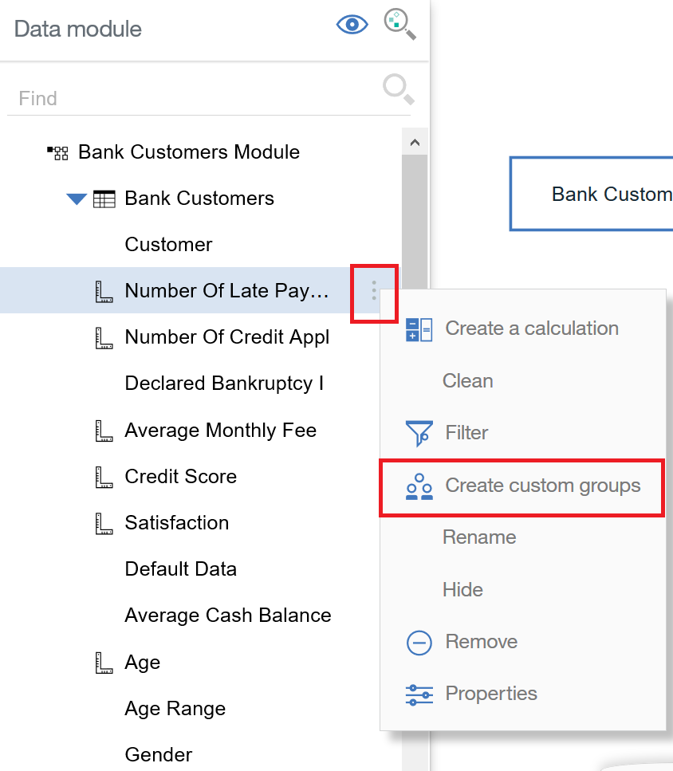
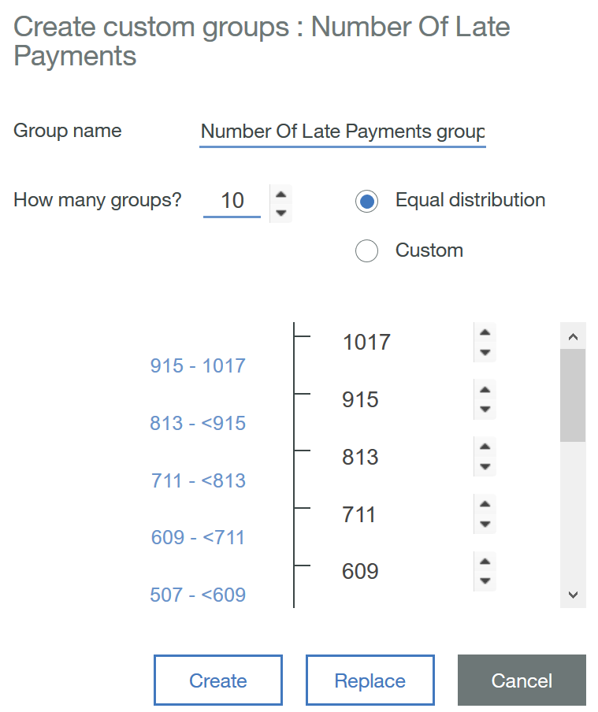
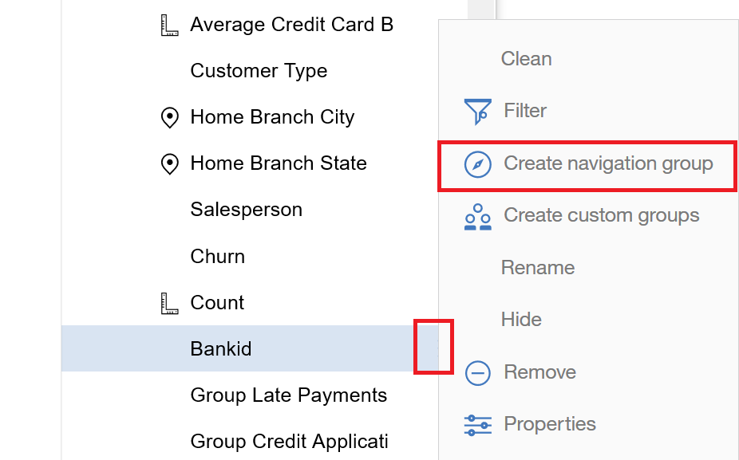
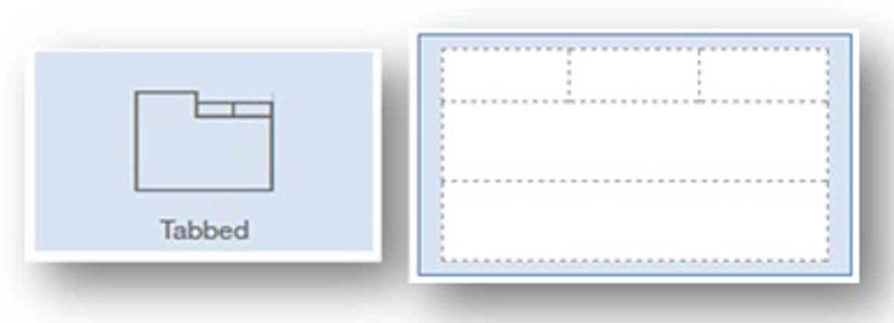
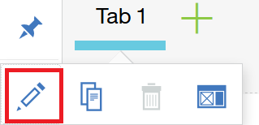
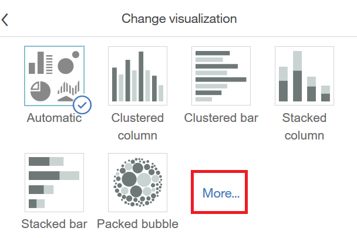

# Visualize Your Data

"K Bank" has found that customer loss (churn) is directly related to the customer's satisfaction level. This is kind of obvious, so it would be interesting to see how these churn prediction models could be used to looks at "N Bank" customers and identify who might be at risk of leaving. Since "K Bank" just spent a lot of money to acquire "N Bank", you do not want to lose any customers if you can help it.

Now that we have the data in one place, we can explore the data and discover how satisfied your customers are, within each Bank and across both Banks. You can also identify which customers are leaving the bank and which ones you should work to retain going forward. You can also create a dashboard to showcase your findings and use it to tell a story of what you discovered and any actions you might want to take base on this analysis for use in your next board meeting.

## Setup Cognos

Launch [Cognos Free Trial](https://www.ibm.com/analytics/us/en/technology/products/cognos-analytics/)
and SIGN IN to bring up the login page.

The NEW User Experience brings you directly into the completely
redesigned Cognos Analytics User Interface (UI). All Cognos Analytics
Users begin their navigation here.

### Create a Data server connection

1. On the Welcome screen, select Manage on the bottom left side. Select Data server connections to create a new data server.

1. Create a new data server connection by selecting the ‘+’ and Select dashDB as the type

1. Rename the connection name from New data server connection to IA_Bank Customers

1. Enter the your dashDB JDBC URL service credentials you obtained in the [prework exercise](https://github.com/ibm-cloud-architecture/refarch-cloud-data-analytics/blob/master/PreWork.md#step-d-create-the-dashdb-credentials).  Copy the "jdbcurl" (NOT the "ssljdbcurl") and paste into Cognos Analytics.  Your JDBC URL might look something like this (do not paste the quotes):  **"jdbc:db2://dashdb-entry-yp-dal09-08.services.dal.bluemix.net:50000/BLUDB"**

1. You need to specify the sign in credentials for the dashDB user to use each time you connect to this database. Select the Use the following signon check mark  

1. Select the  ‘+’ icon 

1. Enter the your dashDB User ID

1. Enter your password and confirm your password

1. Click on the Test Button to verify your new connection.  If it tests successfully, then

1. Click Save

If the test fails, check the userID, password, etc. and re-test.

Now we need to select the database schema (table owner) that we will use in this exercise. 

1. Select the Schema tab for the IA\_Bank Customers data server connection

1. Select the schema associated to your userid and select

1. Select Load metadata. 

 When the schema is successfully loaded, the status button next to the schema will turn green

### Create a Data Module

With Cognos Analytics, users are not restricted to only using existing enterprise data sources. Users can blend perosnal data or external data with enterprise data to gain deeper insight. Users can connect to enterprise data directly, or they can import other data sets from from files or other data sources into Cognos Analytics. These data sources can be blended, cleansed and joined together to create a reusable **data module** for use in dashboards and reports, and/or shared with other users in the organization. Although this lab has only one data source, we will still create a data module.

To create a new data module, select New from Navigation Bar on the left side of the Cognos Analytics screen and then select Data module

This will take you to the Create data module screen and provide a list of options you can choose from. 

1. Select Data servers (because we are going to connect to the ‘IA_Bank Customers’ data server connection you created earlier.

1. Select IA_Bank Customers from the list. This will display the schema we created earlier. 

1. Select the ‘Schema’ associated with your dashDB instance, ours is **DASH106554** in this instance.

Your schema will now be added to Selected sources list. Again ours is **DASH106554**.

Click on the Start button.

### Data modeling

Once a data source is selected, users can enter their desired search term(s) and click on Go to look for tables with data related to that search term. Cognos Analytics will analyze the data source and present table(s) that have some relation to the term you entered that you can add to your data module. Since we want to look into our Bank customers to analyze satisfaction and churn data,  

1. In the intent panel, type Customers

1. Click on Go

1. You should only see a table named **Bank Customers**.  Select the Bank Customers table

1. Click on Add this proposal

Your data module should look like this

We will save our data module now.

1. Click Save.

1. Select My Content.

1. Type ‘Bank Customers Module’ for the name.

1. Click Save

Expand the Bank Customers table in the Data Module View

You have told us that your Data Scientists have found some interesting correlations between the number of late payments a customer has had in the past and their propensity to churn. Because this has been identified as an interesting factor for further analysis, we will divide the data into groups based on how many late payments they have had. 

Select the Number of Late Payments column and click on more options (the 3 dots, one above the other)

Select Create custom groups

We can see that Cognos Analytics suggests creating an equal distribution of the late payment values into 10 groups distributed evenly.

However, we will create 3 groups based on the findings of your Data Scientists.

1. Change the Group name to Group Late Payments

1. Change How many groups? from 10 to 3

1. Select Custom

1. Change the lowest value to 1

1. Change the middle value to 21

1. Change the highest value to 3000

1. Click on Create

The data scientists have also observed a correlation between the number of credit applications a customer has submitted and their tendency to churn. So we will also create a another Custom group for the number of credit applications. Create a
new custom group based on the Number of Credit Applications.

Again, we will create 3 groups.

Select the Number of Credit Applications column and click on more options

1. Change the Group name to Group Credit Applications (Note, we mis-spelled this, but you can spell it correctly if you wish)

1. Change How many groups? from 10 to 3

1. Select Custom

1. Change the lowest value to 5

1. Change the middle value to 26

1. Change the highest value to 3000

1. Click on Create

**Save the data module**

### Create Navigation Group

Navigation groups allow drill downs that align with how users want or need to analyze their business. In this case the Bankid column identifies whether the data is from "K Bank" or "N Bank". 

In the Data module

- Scroll to the Bankid column and select it

- Select more options for the Bankid column

- Select Create navigation group. 

The default name will be Bankid since that is the name of the column we selected first.

In our Analysis we want to look at information by Originating Bank, churn, customer type, branch location and customer.

1. Rename the Navigation Group to Bank Churn Drill Path

1. Drag the Churn column below Bankid

1. Drag the Customer Type column below Churn

1. Drag the Home Branch State column below Customer Type

1. Drag the Customer column below Home Branch State

1. Click on Apply

There are many more things we could do in this data module, but for now let's save it and start looking for insight.

## Getting Insight

From the main Cognos Analytics Screen, click on the + sign on the left hand side and select Dashboard.

The Template window then appears, allowing you to select the type of dashboard and the template style. 

Select the tabbed dashboard style. This will allow you to have multiple pages for your dashboards. 

Select the template with the three small rectangles (panels) across the top, and two full width panels below. 

Click on OK.

Each panel on the template acts as a placeholder for dashboard objects, known as widgets. Templates are device aware and will auto-size to the screen of the device being used.

As we build the dashboard, we will reference the location placement for widgets we create in the dashboard template using the following panel numbers

Select the data module we just created, and then 

1. Select the '+' to add sources to the Dashboard

1. Select My content

1. Select the Bank Customers Module

1. Click Open

### Designing a Dashboard

Since this is the first dashboard we are creating you can see in the image above that the default name is Tab1. 

- Click on the tab name Tab 1

- Select the Pencil to bring up the toolbar

- Rename the tab to **Customer Satisfaction**

- Click on the triangle beside the Bank Customers table name to expand it and show the columns in the table

- Drag the satisfaction column to panel 1. Remember the panel layout I showed you earlier? If not, go back and look at the field numbers for the areas of this tab's format.

- Here we can see the average satifaction rating for our customers is 3.39 out of 5

> Note - Satisfaction is very easy to locate in this case because it is one of the first few fields in the list. You can also search for columns names using the Find area at the top of the screen.

Next we want to look at satisfaction by customer type, so we need to select the Satisfaction column and then Control-Click the Customer type column and drag them to Panel 2. 

Cognos Analytics gives a visualization to start based on the data types and number of values of the columns selected, but you can change these visualizations by selecting the Change Visualization icon. 

That will show the visualizations that best suit the data types of the columns inside the visualization. You can always select **More** if you do not see a format you like. You can click anywhere else in the dashboard to close this window.

Now save the dashboard.  

1. Click Save

1. Select My Content

1. Name the Dashboard ‘Bank Customer Analysis

1. Click Save

If the data source panel is not open, from the Navigation panel on the left side of the screen, select sources to open the data source panel and select the **Bank Customers** data source we are working with.

Expand both ‘Navigation paths’ and ‘Bank Customers’ to list the items they contain by clicking on the triangle beside those names.

1. Under Navigation paths, expand the Bank Churn Drill Path and select Bankid

1. Ctrl-Click Satisfaction under Bank Customers

1. Drag these items to Panel 4

**Notice that there is little difference in the overall satisfaction between the two banks.**

1. Under Bank Customers Select Satisfaction

1. Under Bank Customers Age Range

1. Under Bank Customers Gender

1. Drag these items to Panel 5

Change the visualization in Panel 5 to a Heat Map

Your Dashboard should like this now

**Notice that on average Males are more satisfied than females, and that on the right, our older customers are the least satisfied.**

Save the Dashboard

Now, let's add another Tab to the Dashboard.  

Click on the green + sign

1. For the template we will choose the 2 x 2 Template

1. Select USE

> Note - The four panels are also numbered in this image so we can explain placement later.

Rename this tab to Churn Analysis

Make Panel 1 and 2 look like this using these steps

> Under Bank Customers Select Group Late Payments
>
> Under Bank Customers Ctrl-Click Count
>
> Under Bank Customers Ctrl-Click Churn
>
> Drag items to Panel 1
>
> Expand Visualization to use Panel 1 and 2
>
> Change the Visualization to a Heat Map

Make Panel 3 and 4 look like this using these steps

> Under Bank Customers Select Group Credit Applications
>
> Under Bank Customers Ctrl-Click Count
>
> Under Bank Customers Ctrl-Click Churn
>
> Drag items to Panel 3
>
> Expand Visualization to use Panel 3 and 4
>
> Change the Visualization to a Heat Map

The Churn Analysis Tab Should now look like this

Save the Dashboard

Using Properties for each object, make this Dashboard visually appealing
by moving legends and adding titles and removing titles.

Find Insights in the Information
================================

Explore the information in the Dashboard and Share 3 Insights from the
Information you created

Insight 1
\_\_\_\_\_\_\_\_\_\_\_\_\_\_\_\_\_\_\_\_\_\_\_\_\_\_\_\_\_\_\_\_\_\_\_\_\_\_\_\_\_\_\_\_\_\_\_\_\_\_\_\_\_\_\_\_\_\_\_\_\_\_\_\_\_\_\_

Insight 2
\_\_\_\_\_\_\_\_\_\_\_\_\_\_\_\_\_\_\_\_\_\_\_\_\_\_\_\_\_\_\_\_\_\_\_\_\_\_\_\_\_\_\_\_\_\_\_\_\_\_\_\_\_\_\_\_\_\_\_\_\_\_\_\_\_\_\_

Insight 3
\_\_\_\_\_\_\_\_\_\_\_\_\_\_\_\_\_\_\_\_\_\_\_\_\_\_\_\_\_\_\_\_\_\_\_\_\_\_\_\_\_\_\_\_\_\_\_\_\_\_\_\_\_\_\_\_\_\_\_\_\_\_\_\_\_\_\_
