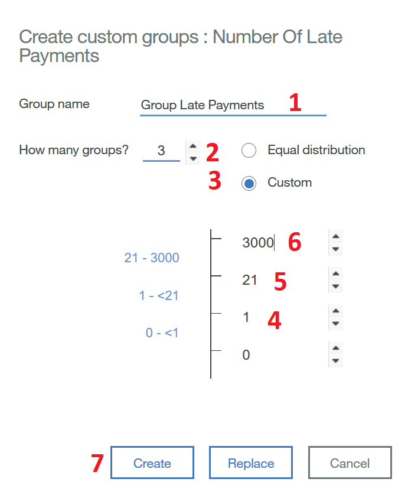
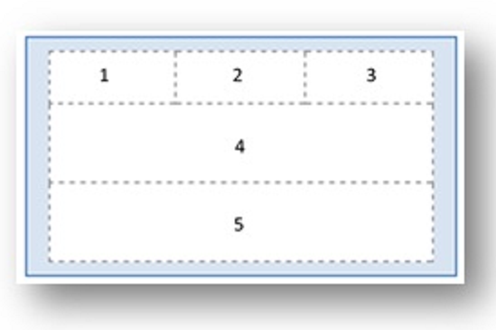
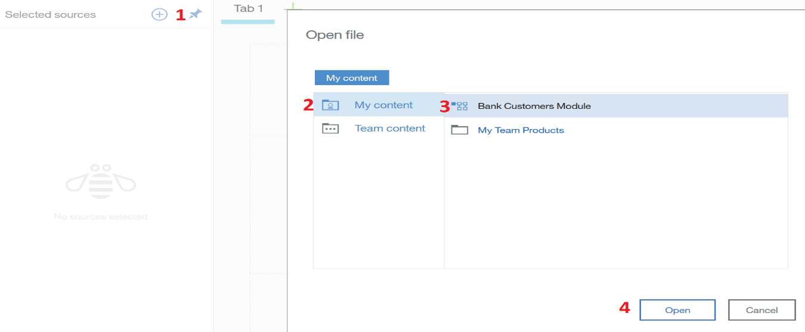
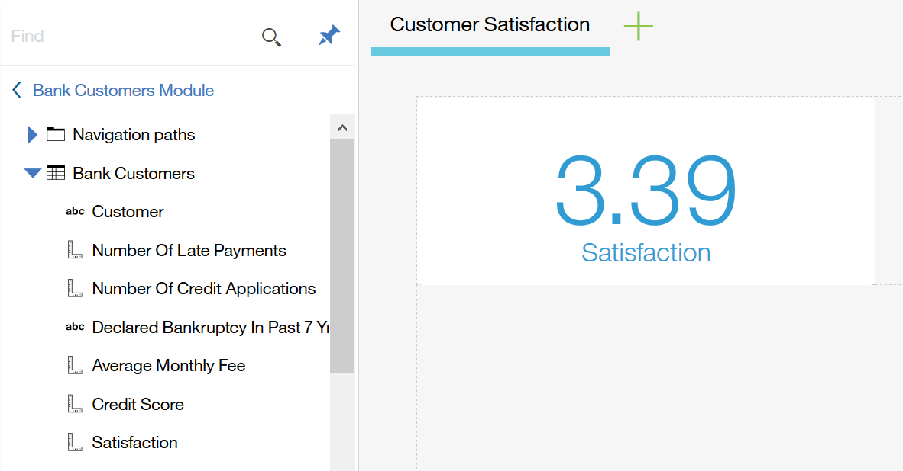
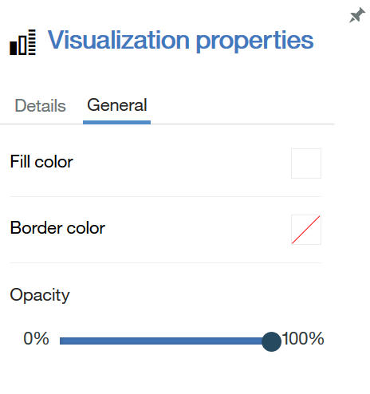

# Visualize Your Data

"K Bank" has found that customer loss (churn) is directly related to the customer's satisfaction level. This is kind of obvious, so it would be interesting to see how these churn prediction models could be used to looks at "N Bank" customers and identify who might be at risk of leaving. Since "K Bank" just spent a lot of money to acquire "N Bank", you do not want to lose any customers if you can help it.

Now that we have the data in one place, we can explore the data and discover how satisfied your customers are, within each Bank and across both Banks. You can also identify which customers are leaving the bank and which ones you should work to retain going forward. You can also create a dashboard to showcase your findings and use it to tell a story of what you discovered and any actions you might want to take base on this analysis for use in your next board meeting.

## Get Things Setup

Launch [Cognos Free Trial](https://www.ibm.com/analytics/us/en/technology/products/cognos-analytics/)
and SIGN IN to bring up the login page.

The NEW User Experience brings you directly into the completely
redesigned Cognos Analytics User Interface (UI). All Cognos Analytics
Users begin their navigation here.

## Create a Data server connection

1. On the Welcome screen, select Manage on the bottom left side. Select Data server connections to create a new data server.

1. Create a new data server connection by selecting the ‘+’ and Select dashDB as the type

1. Rename the connection name from ‘New data server connection’ to ‘IA_Bank Customers’
1. Enter the your dashDB JDBC URL service credentials you obtained in the [prework exercise](https://github.com/ibm-cloud-architecture/refarch-cloud-data-analytics/blob/master/PreWork.md#step-d-create-the-dashdb-credentials).  Copy the "jdbcurl" (NOT the "ssljdbcurl") and paste into Cognos Analytics.  Your JDBC URL might look something like this (do not paste the quotes):  **"jdbc:db2://dashdb-entry-yp-dal09-08.services.dal.bluemix.net:50000/BLUDB"**

1. Create a signon associated to the new data connection. Select the ‘Use the following signon’ check box 
1. Select the  ‘+’ icon.

1. Enter the your dashDB User ID
1. Enter your password and confirm your password
1. Test your new connection.  If it tests successfully, then
1. Save

If the test fails, check the userID, password, etc. and re-test.

Now we need to select the database schema (table owner) that we will use in this exercise. 

1. Select the Schema tab for the IA\_Bank Customers data server connection
1. Select the schema associated to your userid and select
1. Select Load metadata. 

 When the schema is successfully loaded, the status button next to the schema will turn green

## Create a Data Module

With Cognos Analytics, users are not restricted to only using existing enterprise data sources. Users can blend perosnal data or external data with enterprise data to gain deeper insight. Users can connect to enterprise data directly, or they can import other data sets from from files or other data sources into Cognos Analytics. These data sources can be blended, cleansed and joined together to create a reusable **data module** for use in dashboards and reports, and/or shared with other users in the organization. Although this lab has only one data source, we will still create a data module.

To create a new data module, select New from Navigation Bar on the left side of the Cognos Analytics screen and then select Data module

This will take you to the Create data module screen and provide a list of options you can choose from. 

1. Select Data servers (because we are going to connect to the ‘IA_Bank Customers’ data server connection you created earlier.
1. Select IA_Bank Customers from the list. This will display the schema we created earlier. 
1. Select the ‘Schema’ associated with your dashDB instance, ours is **DASH106554** in this instance.

Your schema will now be added to Selected sources list. Again ours is **DASH106554**.

Click on the Start button.

## Data modeling

Once a data source is selected, Users can enter their desired search term and click on Go to look for tables with data related to that search term. Cognos Analytics will analyze the data source and present table(s) that have some relation to the term you entered that you can add to your data module. 

1. In the intent panel, type Customers since the user is interested in Customer information to
analyze Satisfaction and Churn information.
1. Click on Go
1. You should only see one table **Bank Customers**.  Select Bank Customers
1. Click on Add this proposal

Your data module should look like this

We will save our data module now.

1. Click Save.
1. Select My Content.
1. Type ‘Bank Customers Module’ for the name.
1. Click Save

Expand the Bank Customers table in the Data Module View

We know that your Data Scientists have found some interesting correlations between the number of late payments a customer has had in the past and their propensity to churn. Because this has been identified as an interesting factor for further analysis, we will divide the data into groups based on how many late payments they have had. 

Select the Number of Late Payments column and click on more options (the 3 dots, one above the other)

Select Create custom groups

We can see that Cognos Analytics suggests creating an equal distribution of the late payment values into 10 groups distributed evenly.

However, we will create 3 groups based on the findings of your Data Scientists.

1. Change the Group name to Group Late Payments
1. Change How many groups? from 10 to 3
1. Select Custom
1. Change the lowest value to 1
1. Change the middle value to 21
1. Change the highest value to 3000
1. Click on Create

The data scientists have also observed a correlation between the number of credit applications a customer has submitted and their tendency to churn. So we will also create a another Custom group for the number of credit applications. Create a
new custom group based on the Number of Credit Applications.

Again, we will create 3 groups.

Select the Number of Credit Applications column and click on more options

1. Change the Group name to Group Credit Applications (Note, we mis-spelled this, but you can spell it correctly if you wish)
1. Change How many groups? from 10 to 3
1. Select Custom
1. Change the lowest value to 5
1. Change the middle value to 26
1. Change the highest value to 3000
1. Click on Create

**Save the data module**

## Create Navigation Group

Navigation groups allow drill downs that align with how users wnat (need) to analyze their business. In this case the Bankid column identifies whether the data is from "K Bank" or "N Bank". 

In the Data module, scroll to the Bankid column and then select it. Select more options for the Bankid column and select Create navigation group. The default name will be Bankid since that is the name of the column we selected first.

In our Analysis we want to look at information by Originating Bank, churn, customer type, branch location and customer.

1. Rename the Navigation Group to Bank Churn Drill Path
1. Drag the Churn column below Bankid
1. Drag the Customer Type column below Churn
1. Drag the Home Branch State column below Customer Type
1. Drag the Customer column below Home Branch State
1. Click on Apply

There are many more things we could do in this data module, but for now let's save it and start looking for insight.

## Start Getting Some Insight

We will now create a dashboard to analize the information created in our
data module.

Create a new dashboard from the Navigation pane

Working with Templates
----------------------

The Template window appears allowing the user to select the type of
dashboard and the template style. Select the tabbed dashboard style.
This will allow you to have multiple pages for your dashboards. Select
the template with the three (3) small panels across the top, and two (2)
panels below. Click OK

Each panel on the template acts as a placeholder for dashboard objects,
known as widgets. Templates are device aware and will auto-size to the
screen of the device being used.

Cognos Analytics provides many “out of the box” templates to choose
from. This library of templates is based on dashboard design best
practices. The templates are simply guidelines that allow quick and
visually appealing layout of widgets onto the dashboard. However, users
may still customize layouts to suit their preferences and may also
choose to start from a freeform (blank) template.

As we build the dashboard, we will reference the location placement for
widgets in the dashboard template using the following panel numbers

As we start our dashboard design we will be asked to select the data
sources to use. We will select the data module we just created.
Dashboards support the use of many data sources, in this example we will
only use 1

> Select the '+' to add sources to the Dashboard
>
> Select My Content
>
> Select Bank Customers Module
>
> Click Open

Working with Dashboard Design
-----------------------------

Rename Tab1. To rename the dashboard tab, click on the tab name “Tab 1”
to bring up the On-Demand Toolbar. Select the Pencil and rename the tab
to 'Customer Satisfaction'

Expand Bank Customers and drag Staisfaction to Panel 1. Here we can see
the average Satifaction rating by our customers is 3.39.

Satisfaction is very easy to locate here because its one of the first 10
fields in the list, again like everything else in Cognos Analytics there
is a Find area where you can find fields very quickly.

Next we will select Satisfaction and Ctrl Click Customer type and drag
it to Panel 2. Cognos Analytics gives me a visualization to start based
on the items selected. I can change these visualizations by selecting
the Change Visualization icon.

By Deault we will show the visualizations that best suit the items and
there types inside the visualization. You can always select ‘**More**’.
Click anywhere else in the dashboard to remove this window.

Select the bar chart just created, we will now look at actions available
to you from the menu bar.

> The View widget icon allows users to decide which widgets will be
> connected to which other widgets in the dashboard. By default all
> widgets in the dashboard are automatically connected without any
> coding.
>
> The pin will pin the widget for further use in other dashboards or to
> be used for story telling.
>
> The properties item is what we will look at now. The properties allows
> you to customize and change the properties of the widget
>
> The user icon we talked about earlier as well as the help.

Select the Properties Icon for the bar chart. Under the General Area, we
can change the color pallette, column color, maintain axis scale, and
Hide axis titles. Also, if dealing with changing data, set the refresh
rate for this widget to pickup the refreshed data in near real time
without having to take a user action. If refresh data set is on, we
first verify the data is changed before resubmitting the query of the
widget.

Here I have set the Column Color to Green and I have enabled ‘Hide axis
titles’

Under the General Tab you see options to set the ‘Fill color’, ‘Border
color’ and you can set the Opacity of the widget of object selected in
the dashboard. If we had a image selected here, we might change the
Opacity to a lower number to use it as a background image for the Tab
and/or individual widget.

To remove the Properties, click the Properties icon on the menu bar
again.

Note : The properties will change depending on the type of visualization
or object selected. For instance if a text object is selected, you would
see properties associated with a text item. The same is true if a
picture or video object is selected.

Resize the Customer Type Satisfaction bar chart to span Panel 2 and 3 by
dragging the resize button on the right to the end of the template to
look like this.

Let’s save the Dashoard

> Click Save
>
> Select My Content
>
> Name the Dashboard ‘Bank Customer Analysis
>
> Click Save

If the data source panel is not open, from the Navigation panel, select
Sources to open the data source panel. The Data Source panel displays
the Banking Customers Source we are working with.

Expand ‘Navigation paths’ and ‘Bank Customers’ to list the items.

> From Navigation Paths under Bank Churn Drill Path select Bankid
>
> Ctrl-Click Satisfaction under Bank Customers
>
> Drag these items to Panel 4

For Panel 5

> Under Bank Customers Select Satisfaction
>
> Under Bank Customers Age Range
>
> Under Bank Customers Gender
>
> Drag these items to Panel 5

Change the Visualization in Panel 5 to a Heat Map

Your Dashboard should like this now.

Save the Dashboard

Create a New Tab in the Dashboard

For the template we will choose the 2 x 2 Template and select USE

The 4 Panels are also numbered in this image

Rename the tab ‘Churn Analysis’

Make Panel 1 and 2 look like this using these steps

> Under Bank Customers Select Group Late Payments
>
> Under Bank Customers Ctrl-Click Count
>
> Under Bank Customers Ctrl-Click Churn
>
> Drag items to Panel 1
>
> Expand Visualization to use Panel 1 and 2
>
> Change the Visualization to a Heat Map

Make Panel 3 and 4 look like this using these steps

> Under Bank Customers Select Group Credit Applications
>
> Under Bank Customers Ctrl-Click Count
>
> Under Bank Customers Ctrl-Click Churn
>
> Drag items to Panel 3
>
> Expand Visualization to use Panel 3 and 4
>
> Change the Visualization to a Heat Map

The Churn Analysis Tab Should now look like this

Save the Dashboard

Using Properties for each object, make this Dashboard visually appealing
by moving legends and adding titles and removing titles.

Find Insights in the Information
================================

Explore the information in the Dashboard and Share 3 Insights from the
Information you created

Insight 1
\_\_\_\_\_\_\_\_\_\_\_\_\_\_\_\_\_\_\_\_\_\_\_\_\_\_\_\_\_\_\_\_\_\_\_\_\_\_\_\_\_\_\_\_\_\_\_\_\_\_\_\_\_\_\_\_\_\_\_\_\_\_\_\_\_\_\_

Insight 2
\_\_\_\_\_\_\_\_\_\_\_\_\_\_\_\_\_\_\_\_\_\_\_\_\_\_\_\_\_\_\_\_\_\_\_\_\_\_\_\_\_\_\_\_\_\_\_\_\_\_\_\_\_\_\_\_\_\_\_\_\_\_\_\_\_\_\_

Insight 3
\_\_\_\_\_\_\_\_\_\_\_\_\_\_\_\_\_\_\_\_\_\_\_\_\_\_\_\_\_\_\_\_\_\_\_\_\_\_\_\_\_\_\_\_\_\_\_\_\_\_\_\_\_\_\_\_\_\_\_\_\_\_\_\_\_\_\_
